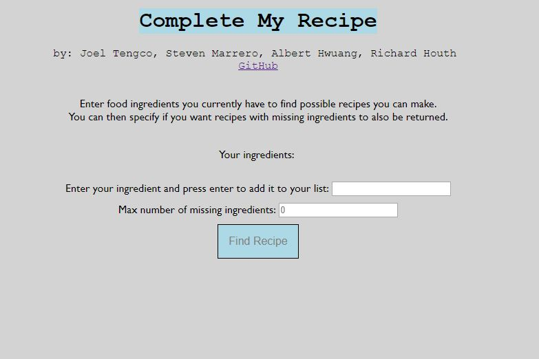
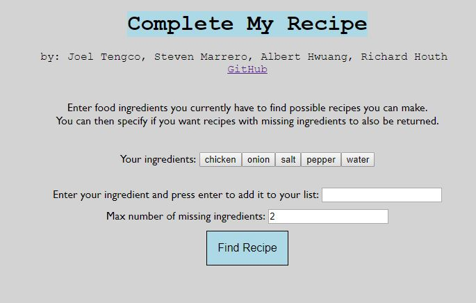
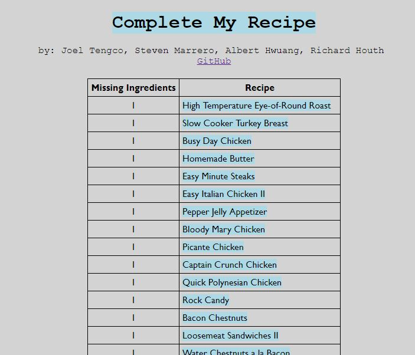
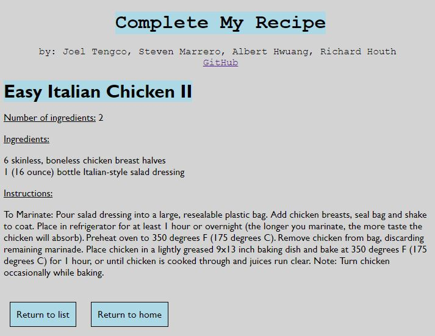

Project for CS 4800 - Software Engineering

# Complete My Recipe

Enter the spare ingredients you have in your pantry and receive a list of recipes that include those ingredients and the additional ingredients you need to complete the recipe.

The project was deployed to pythonanywhere.com, and was live for a few months. Below are some screenshots of the web application at the time it was active.

## Examples

